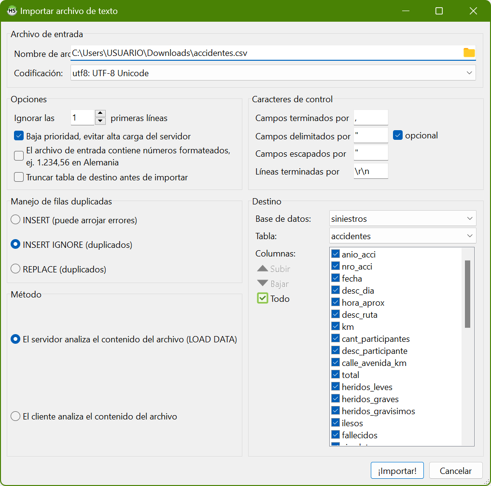

# README

## Introducción

En este trabajo, vamos a desarrollar un proceso completo de gestión y análisis de una base de datos, comenzando desde la importación de un archivo CSV hasta la realización de consultas. Utilizaremos HeidiSQL como herramienta para manejar y organizar la información . El objetivo es mostrar, paso a paso, cómo transformar un conjunto de datos en  formato CSV a una base de datos estructurada, y luego realizar consultas que nos permitan obtener información relevante. Este proceso servirá para entender cómo trabajar con bases de datos desde cero.

En nuestro caso hemos seleccionado una base de datos de siniestros viales del año 2020 de la provincia de Santa Fe.

A continuación detallaremos el paso a paso.

## Índice
[Importar archivo CSV](##Importar-archivo-CSV)

## Descarga de la base de datos

Primero, ingresamos al portal de datos abiertos de la provincia de Santa Fe a través del siguiente enlace: [Observatorio Vial](https://datos.santafe.gob.ar/dataset/observatorio-vial).  Allí, seleccionamos el conjunto de datos sobre siniestros viales correspondiente al año 2020 y descargamos la base de datos en formato CSV.

<aside>
💡

Antes de importar el archivo CSV se debe crear la base de datos donde se integrarán los datos dentro de una tabla.

</aside>

Se crea con el siguiente código:

```sql
create database siniestros;
```

## Importar archivo CSV

Para importar el archivo “accidentes.csv” en **HeidiSQL**, se deben seguir los siguientes pasos:

1.  Ir a la sección de herramientas > Importar archivo CSV para poder cargar los datos de la base de datos.



1. Se va abrir esta ventana donde vamos a cargar nuestro archivo CSV con la configuración como se muestra en la imagen.


Debe estar configurado de la misma forma como se muestra en la imagen. En la primera línea se debe elegir el archivo “.csv”.   En la sección “Destino” se debe colocar la base de datos ya creada y en la opción tabla seleccionar nueva tabla.

1. Al momento de crear una tabla nueva, va a salir esta ventana donde se debe presionar en “OK, crear tabla”.


Luego volverá a la pantalla anterior en donde se debe presionar el botón “!Importar¡”

1. Generaremos una tabla que contendrá toda la información de forma completa. Posteriormente, esta información se dividirá en diferentes tablas para organizar de manera más eficiente y clara la estructura de la base de datos


## Creación del diagrama de la base de datos

Para entender mejor la estructura de los datos y cómo se relacionaban entre sí, creamos un diagrama en **MySQL Workbench**. Esta herramienta nos ayudó a visualizar las tablas, sus campos y las relaciones entre ellas, lo que nos dio una visión clara de la estructura que íbamos a implementar.


<aside>
💡

Ahora pasaremos a explicar como fue el proceso para crear y modificar las tablas, junto a sus relaciones e inserciones. Pero para tener la base de datos listas para realizar consultas no es necesario que siga el mismo procedimiento que el nuestro. Por eso se armó un archivo llamado “pasos.txt” en el cual tiene un código que se tiene que copiar y pegar dentro de Heidi, para así tener la base de datos, armada y lista para consultarla. 

</aside>

## Organizar y dividir la información

En este paso es necesario separar la tabla en varias tablas más pequeñas para organizar mejor la información y evitar duplicados.

---

También definimos cómo se relacionarán las tablas, usando claves primarias y foráneas.

### Creación de Tablas

- Estado del clima

```sql
CREATE TABLE EstadoClima(
	clim_cod INT(11) PRIMARY KEY AUTO_INCREMENT,
	clim_desc VARCHAR(45)
);
```

- Tipo zona

```sql
CREATE TABLE tipozona (
	tpzo_cod INT(11) PRIMARY KEY AUTO_INCREMENT,
	tpzo_desc VARCHAR(45)
);
```

- Tipo de calle (vía)

```sql
CREATE TABLE tipo_calle (
	tpca_cod INT(11) PRIMARY KEY AUTO_INCREMENT,
	tpca_desc VARCHAR(45)
);
```

- Días de la semana

```sql
CREATE TABLE Dias (
	dia_cod INT(11) PRIMARY KEY AUTO_INCREMENT,
	dia_desc VARCHAR(45)
);
```

- Participantes

```sql
CREATE TABLE Participantes (
	part_cod INT(11) PRIMARY KEY AUTO_INCREMENT,
	part_desc VARCHAR(45)
);
```

- Departamentos

```sql
CREATE TABLE Departamentos (
	dept_cod INT(11) PRIMARY KEY AUTO_INCREMENT,
	dept_desc VARCHAR(45)
);
```

- Localidades

```sql
CREATE TABLE Localidades (
	loca_cod INT(11) PRIMARY KEY AUTO_INCREMENT,
	loca_desc VARCHAR(45),
	dept_cod INT (11),
	CONSTRAINT fk_dept_cod FOREIGN KEY (dept_cod) REFERENCES departamentos (dept_cod)
);
```

- Accidente_has_Participantes

```sql
CREATE TABLE Accidente_has_Participantes (
    acci_cod INT,
    part_cod INT,
    CONSTRAINT pk_acci_part PRIMARY KEY (acci_cod, part_cod),
    CONSTRAINT fk_acci_cod FOREIGN KEY (acci_cod) REFERENCES accidentes(acci_cod) ,
    CONSTRAINT fk_part_cod FOREIGN KEY (part_cod) REFERENCES participantes(part_cod)
);
```

### Inserción de datos

En esta parte el proceso nos encargamos de llenar las tablas creadas con los datos correspondientes

- Días de la semana

```sql
INSERT INTO dias (dia_desc)
SELECT DISTINCT desc_dia
FROM accidentes;
```

- Tipo de zona

```sql
INSERT INTO tipozona (tpzo_desc)
SELECT DISTINCT desc_zona
FROM accidentes;
```

- Tipo de calle

```sql
INSERT INTO tipo_calle (tpca_desc)
SELECT DISTINCT desc_tipo_via
FROM accidentes;
```

- Estado del clima

```sql
INSERT INTO estadoclima (clim_desc)
SELECT DISTINCT desc_estado_clima
FROM accidentes;
```

- Departamentos (provincia)

```sql
INSERT INTO departamentos (dept_desc)
SELECT DISTINCT desc_dpto
FROM accidentes;
```

- Localidades

```sql
INSERT INTO Localidades (loca_desc, dept_cod)
SELECT DISTINCT a.desc_loc, d.dept_cod
FROM accidentes a
JOIN Departamentos d ON a.desc_dpto = d.dept_desc; 
```

- Participantes:

```sql
-- se separó los datos por coma
INSERT INTO Participantes (part_desc)
SELECT DISTINCT SUBSTRING_INDEX(SUBSTRING_INDEX(a.desc_participante, ',', n.n), ',', -1)
FROM accidentes a
JOIN (SELECT 1 AS n UNION SELECT 2 UNION SELECT 3 UNION SELECT 4 UNION SELECT 5 UNION SELECT 6) n
WHERE CHAR_LENGTH(a.desc_participante) - CHAR_LENGTH(REPLACE(a.desc_participante, ',', '')) >= n.n - 1;
```

- Participante - accidente (tabla intermedia)

```sql
INSERT INTO accidente_has_participantes (acci_cod, part_cod)
SELECT DISTINCT a.acci_cod, p.part_cod
FROM accidentes a
JOIN (SELECT 1 AS n UNION ALL SELECT 2 UNION ALL SELECT 3 UNION ALL SELECT 4 UNION ALL SELECT 5 UNION ALL SELECT 6 ) n ON n.n <= 1 + LENGTH(a.desc_participante) - LENGTH(REPLACE(a.desc_participante, ',', ''))
JOIN participantes p ON TRIM(SUBSTRING_INDEX(SUBSTRING_INDEX(a.desc_participante, ',', n.n), ',', -1)) = p.part_desc;
```

### Relacion entre tablas y accidentes

### **Actualizar `desc_loc` con los códigos de localidad**

Actualizamos la columna `desc_loc` para que almacene los códigos de localidad (`loca_cod`):

```sql
UPDATE accidentes a
JOIN localidades l ON TRIM(LOWER(a.desc_loc)) = TRIM(LOWER(l.loca_desc))
SET a.desc_loc = l.loca_cod;
```

Como esto nos daba error que el tipo de datos de `desc_loc` sea compatible con `loca_cod`. Si `loca_cod` es un entero, es posible que debas cambiar el tipo de `desc_loc`.

 

---

***Explicacion del Código:***

1. **`UPDATE accidentes a`**: Indica que vamos a actualizar registros en la tabla `accidentes`, y asignamos el alias `a` para referirnos a ella de forma abreviada.
2. **`JOIN localidades l ON ...`**: Realizamos un `JOIN` (unión) entre `accidentes` y `localidades` para relacionar los registros de ambas tablas. Asignamos el alias `l` a `localidades`.
3. **`TRIM(LOWER(a.desc_loc)) = TRIM(LOWER(l.loca_desc))`**: Esta es la condición para el `JOIN`. Compara el nombre de la localidad en `accidentes` con el de `localidades`:
    - **`LOWER(...)`**: Convierte el texto a minúsculas para que la comparación no sea sensible a mayúsculas y minúsculas.
    - **`TRIM(...)`**: Elimina espacios en blanco al inicio y al final del texto.
    - Al aplicar estas funciones, aumentamos la probabilidad de que los nombres coincidan correctamente, incluso si hay diferencias en mayúsculas o espacios.
4. **`SET a.loca_cod = l.loca_cod`**: Esta es la acción que realizamos en la actualización. Asignamos el valor de `l.loca_cod` (el código de localidad de `localidades`) a `a.loca_cod` (la columna `loca_cod` en `accidentes`).

---

### **Cambiar el Tipo de Datos de `desc_loc` (Si no se realiza este paso el siguiente dara error):**

```sql
ALTER TABLE accidentes
MODIFY COLUMN desc_loc INT(11);
```

En el caso de que NO se cambie a entero con ese codigo sql vamos a obtener este error
`/* Error de SQL (1005): Can't create table siniestros.accidentes (errno: 150 "Foreign key constraint is incorrectly formed") */`

Por lo tanto ejecutar este codigo antes de continuar es fundamental

## **Establecer la Clave Foránea entre `accidentes` y `localidades`**

Ahora que `desc_loc` en `accidentes` contiene los códigos de localidad, puedes establecer una clave foránea para mantener la integridad referencial.

### **Agregar la Clave Foránea:**

```sql
ALTER TABLE accidentes
ADD CONSTRAINT fk_accidentes_loca_cod
FOREIGN KEY (desc_loc) REFERENCES localidades(loca_cod);

```


Si todo sale bien deberia verse el icono de esa llavecita verde

El mismo proceso lo repetimos para la columna de dias ya que es otro dato que se repite mucho

## **Actualizar `desc_dia` con los Códigos de los Días**

### **IMPORTANTE**

Es probable que la columna `desc_dia` sea de tipo `VARCHAR` o `TEXT`, ya que almacena nombres de días. Necesitamos cambiar su tipo de datos a `INT` para poder almacenar los códigos numéricos.

Esto se logra con la siguiente consulta sql para modificar el tipo de datos de `desc_dia`:

```sql
ALTER TABLE accidentes
MODIFY COLUMN desc_dia INT;
```

Ahora, actualizaremos `desc_dia` en la tabla `accidentes` con los códigos correspondientes de la tabla `dias`, basándonos en el nombre del día almacenado en `desc_dia_backup`.

```sql
UPDATE accidentes a
JOIN dias d ON TRIM(LOWER(a.desc_dia_backup)) = TRIM(LOWER(d.dia_desc))
SET a.desc_dia = d.dia_cod;
```

**Establecer la Clave Foránea entre `accidentes` y `dias`**

Una vez que todos los registros tienen el código correcto, es recomendable establecer una clave foránea para mantener la integridad referencial.

### **Agregar la Clave Foránea:**

```sql
ALTER TABLE accidentes
ADD CONSTRAINT fk_accidentes_dia_cod
FOREIGN KEY (desc_dia) REFERENCES dias(dia_cod);

```


Antes de ejecutar la sentencia SQL


Si todo sale bien deberia verse asi

# DESDE ACÁ

tipozona

```sql
ALTER TABLE accidentes ADD COLUMN tpzo_cod INT;

UPDATE accidentes a
JOIN tipozona tz ON TRIM(LOWER(a.desc_zona)) = TRIM(LOWER(tz.tpzo_desc))
SET a.tpzo_cod = tz.tpzo_cod;

ALTER TABLE accidentes DROP COLUMN desc_zona;

ALTER TABLE accidentes
ADD CONSTRAINT fk_accidentes_tpzo_cod
FOREIGN KEY (tpzo_cod) REFERENCES tipozona(tpzo_cod);

```

tipo_calle

```sql
ALTER TABLE accidentes ADD COLUMN tpca_cod INT;

UPDATE accidentes a
JOIN tipo_calle tc ON TRIM(LOWER(a.desc_tipo_via)) = TRIM(LOWER(tc.tpca_desc))
SET a.tpca_cod = tc.tpca_cod;

ALTER TABLE accidentes DROP COLUMN desc_tipo_via;

ALTER TABLE accidentes
ADD CONSTRAINT fk_accidentes_tpca_cod
FOREIGN KEY (tpca_cod) REFERENCES tipo_calle(tpca_cod);

```

estado_clima

```sql
ALTER TABLE accidentes ADD COLUMN clim_cod INT;

UPDATE accidentes a
JOIN estadoclima ec ON TRIM(LOWER(a.desc_estado_clima)) = TRIM(LOWER(ec.clim_desc))
SET a.clim_cod = ec.clim_cod;

ALTER TABLE accidentes DROP COLUMN desc_estado_clima;

ALTER TABLE accidentes
ADD CONSTRAINT fk_accidentes_clim_cod
FOREIGN KEY (clim_cod) REFERENCES estadoclima(clim_cod);

```

### Carga de datos

En este paso nos encargamos de llenar cada tabla con los datos correspondientes

En la tabla de accidentes, en la columna de horas, corregimos los valores vacios por nulos para evitar errores en las futuras consultas.

```sql
UPDATE accidentes
SET hora_aprox = null
WHERE hora_aprox = '';
```

## Bibliografía

Página donde sacamos la base de datos: [https://datos.santafe.gob.ar/dataset/observatorio-vial](https://datos.santafe.gob.ar/dataset/observatorio-vial)

Trabajo realizado por Andrés Fernández y Nicolas Pujol.
